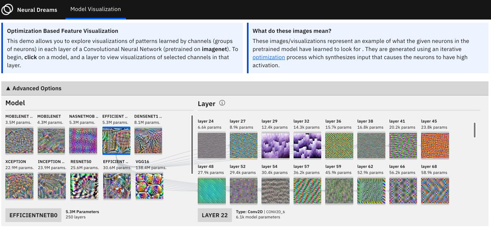

# Neural Dreams

Visual Exploration of Representations Learned by Convolutional Neural Networks. Visualizations are created using the Lucid and lucid4keras libraries to visualize features learned by channels in a layer.
